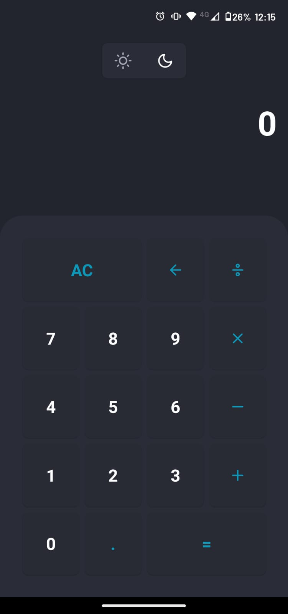

<h1 align="center">Welcome to RN Calculator 👋</h1>
<p>
  
</p>

> A simple calculator made with React Native

> 

### ✨ [Demo](https://github.com/stanlino/rncalculator/tree/master/apk)

## Install

```sh
yarn install
```

## Usage

```sh
yarn run start
```

## Author

👤 **Stanley Filipe Neiva**

* Website: stanleyfilipe.dev
* Github: [@stanlino](https://github.com/stanlino)
* LinkedIn: [@stanley-filipe-neiva-298465164](https://linkedin.com/in/stanley-filipe-neiva-298465164)

## Show your support

Give a ⭐️ if this project helped you!

***
_This README was generated with ❤️ by [readme-md-generator](https://github.com/kefranabg/readme-md-generator)_